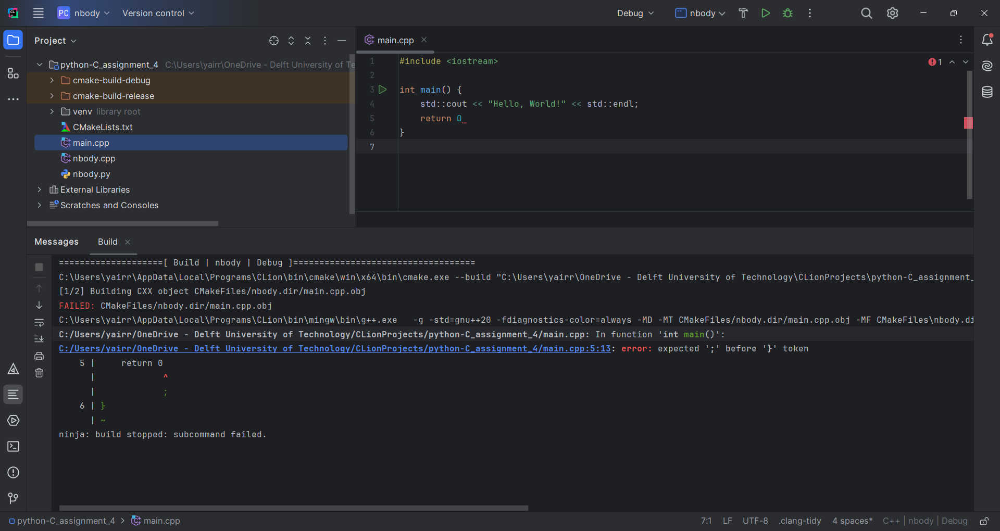

# Assignment 4
Yair Roorda 5467543 
Luc Jonker 4836111
## Differences between Python and C++
_A paragraph (max. 200 words) explaining how the Python and C++ programs are different (How is the information in the simulation represented:
Which data types do the programs use to represent the data for the simulation?)_

The C++ implementation takes advantage of the object-oriented nature of the language, 
for example defining a class 'body' to store the information on the bodies. 
They also nicely define a vector3d class and define operations for addition, subtraction, norm, magnitude, etc. which cuts down on the amount of hard to parse mathematics later on. 
The python version precomputes all pairs of bodies before running, and takes advantage of that for its calculations. 
It uses a dictionary datatype to store these precomputed values since there is no need for indexing and they make for a natural way to couple keys(planets) to values(planet properties)
## Reflection on assignment
_A paragraph reflection on how you went about solving the task (max. 400
words). Which steps did you take? How did you measure the runtime?
How did what you learn about Python help you for developing the C++
solution? Did you get stuck? Which sources did you consult when you
got stuck? Did you expect the results you obtained? Etc._

## Benchmarks
_Timings for Python, C++ Debug and C++ Release, in a table and visualised
in a chart (x-axis: instance size/y-axis: run time). Advice: Use matplotlib
to produce the chart._

## Hardware used
_A short description of the hardware you run the simulation on (CPU,
memory, operating system)._

The system used to perform these tests is an HP Z-book, using Windows 11. The CPU is an Intel(R) Core(TM) i7-8750H CPU @ 2.20GHz. It has 16 GB of RAM.

## Spotting errors in C++

The screenshot above shows a very simple 'Hello World' program which throws
an syntax error at compile time because of the missing semicolon. 
Because we are using Clion as our IDE and the error is very basic the IDE is even able to spot it while writing and shows a red squiggle to alert us. 
The way to remove the error is to add the semicolon back in as the compiler tells us very clearly.

## QGIS
_One (or more, e.g. 1 overview and 1 close-up) screenshot of QGIS, where
you have loaded a CSV file your code did produce for 5’000 iterations. If
you have a recent version of QGIS, you can try to use the 3D map view as
well._